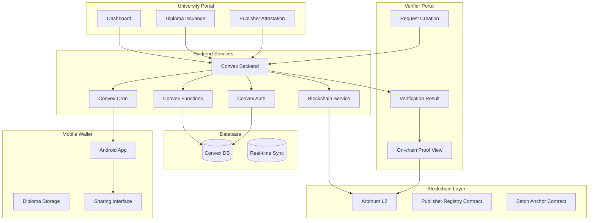
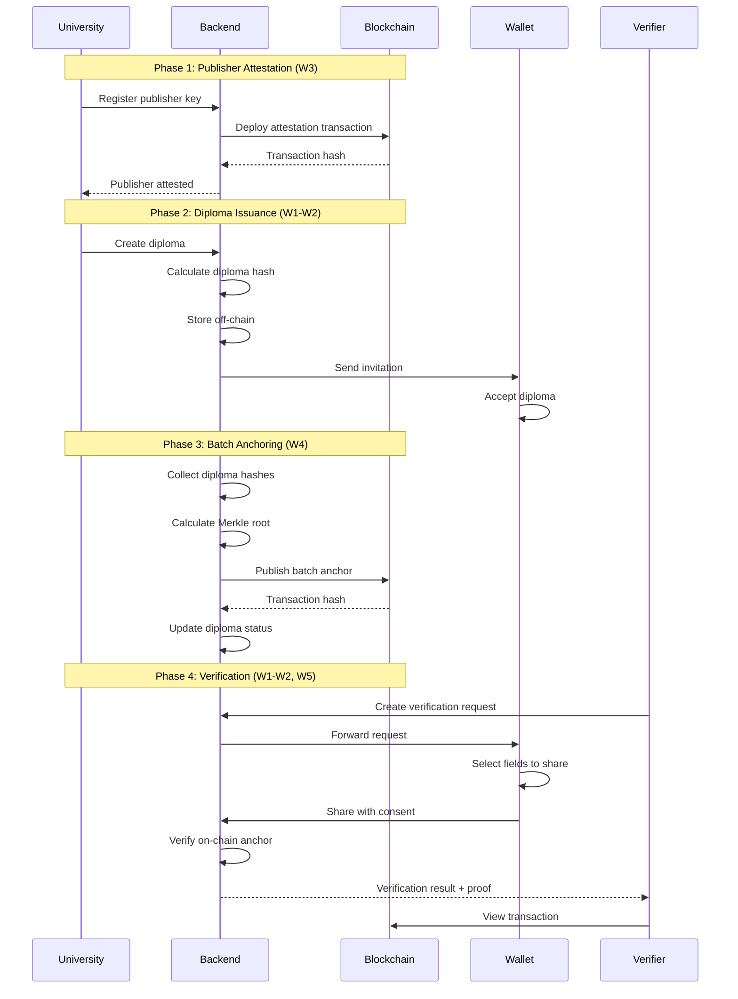

# MVP Implementation Plan: Diploma → Wallet → Verification + Blockchain

## Executive Summary

This document provides a detailed implementation plan for an MVP that demonstrates an end-to-end flow for diploma verification using blockchain technology. The system enables universities to issue digital diplomas, owners to store them in a mobile wallet, and verifiers to request and verify diplomas with selective disclosure, all anchored to an L2 blockchain network without exposing personal data on-chain.

**Timeline**: 6 weeks
**Primary Technology Stack**: Next.js (Web), React Native (Android), Convex (Backend), Ethereum L2 (Arbitrum)
**Core Principle**: Privacy-preserving verification with on-chain hash anchoring only

---

## System Architecture Overview

### High-Level Components



### Data Flow



---

## Technology Stack

### Backend Services
- **Backend Platform**: Convex (real-time database, serverless functions, auth)
- **Language**: TypeScript
- **Database**: Convex Document Database (real-time, reactive)
- **Authentication**: Convex Auth with multiple providers (email, phone)
- **Blockchain**: ethers.js v6 for Arbitrum interaction
- **Hashing**: SHA-256 for diploma fingerprints
- **Merkle Trees**: Custom implementation for batch anchoring
- **Cron Jobs**: Convex Cron for batch anchoring scheduling
- **File Storage**: Convex File Storage for documents

### Frontend (University & Verifier Portals)
- **Framework**: Next.js 16 with React 19
- **Styling**: Tailwind CSS 4
- **State Management**: React Context + Zustand
- **Forms**: React Hook Form + Zod validation
- **UI Components**: shadcn/ui or similar component library

### Mobile Wallet (Android)
- **Framework**: React Native with Expo
- **State Management**: Redux Toolkit or Zustand
- **Storage**: Secure storage for private keys and diplomas
- **Push Notifications**: Firebase Cloud Messaging
- **Biometrics**: React Native Biometrics for secure access

### Blockchain Layer
- **Network**: Arbitrum One (EVM-compatible L2)
- **Smart Contracts**: Solidity ^0.8.20
- **Development Framework**: Hardhat
- **Deployment**: Hardhat Ignition or similar
- **Block Explorer**: Arbiscan integration

### Infrastructure
- **Hosting**: Vercel (Next.js) + Convex (backend)
- **Database**: Convex (managed, real-time)
- **Monitoring**: Sentry for error tracking
- **Logging**: Convex Dashboard logs
- **CI/CD**: GitHub Actions
- **Deployment**: Vercel + Convex deployment integration

---

## Detailed Implementation Plan

### Week 1-2: Core Flow (Without Blockchain)

#### 1.1 Convex Schema Design

**Convex Schema (convex/schema.ts):**

```typescript
import { defineSchema, defineTable } from "convex/server";
import { v } from "convex/values";

export default defineSchema({
  // Universities (Publishers)
  universities: defineTable({
    name: v.string(),
    publisherKey: v.optional(v.string()), // Ethereum address
    attestationTxHash: v.optional(v.string()),
    attestedAt: v.optional(v.number()),
    createdAt: v.number(),
    updatedAt: v.number(),
  })
    .index("by_publisher_key", ["publisherKey"])
    .index("by_name", ["name"]),

  // Diplomas
  diplomas: defineTable({
    universityId: v.id("universities"),
    ownerId: v.id("users"),
    diplomaHash: v.string(),
    batchId: v.optional(v.id("batches")),
    status: v.string(), // pending, accepted, anchored
    data: v.any(), // Encrypted diploma data
    createdAt: v.number(),
    updatedAt: v.number(),
  })
    .index("by_university", ["universityId"])
    .index("by_owner", ["ownerId"])
    .index("by_hash", ["diplomaHash"])
    .index("by_status", ["status"]),

  // Diploma Data Structure (off-chain, encrypted)
  // {
  //   "studentName": "Иван Иванов",
  //   "degree": "Бакалавр",
  //   "specialty": "Информационные технологии",
  //   "issueDate": "2024-06-15",
  //   "graduationDate": "2024-06-15",
  //   "universityName": "МГУ",
  //   "gpa": "4.5",
  //   "diplomaNumber": "123456"
  // }

  // Users (Wallet Owners)
  users: defineTable({
    email: v.string(),
    phone: v.optional(v.string()),
    deviceToken: v.optional(v.string()), // For push notifications
    publicKey: v.optional(v.string()),
    createdAt: v.number(),
  })
    .index("by_email", ["email"])
    .index("by_phone", ["phone"]),

  // Verification Requests
  verificationRequests: defineTable({
    verifierId: v.id("verifiers"),
    diplomaId: v.id("diplomas"),
    requestedFields: v.array(v.string()),
    ttlSeconds: v.number(),
    status: v.string(), // pending, approved, rejected, expired
    sharedData: v.optional(v.any()),
    expiresAt: v.number(),
    createdAt: v.number(),
  })
    .index("by_verifier", ["verifierId"])
    .index("by_diploma", ["diplomaId"])
    .index("by_status", ["status"])
    .index("by_expires", ["expiresAt"]),

  // Verifiers
  verifiers: defineTable({
    name: v.string(),
    email: v.string(),
    organization: v.optional(v.string()),
    createdAt: v.number(),
  })
    .index("by_email", ["email"]),

  // Batches (for blockchain anchoring)
  batches: defineTable({
    universityId: v.id("universities"),
    merkleRoot: v.string(),
    txHash: v.optional(v.string()),
    anchoredAt: v.optional(v.number()),
    status: v.string(), // pending, anchored, failed
    createdAt: v.number(),
  })
    .index("by_university", ["universityId"])
    .index("by_status", ["status"]),

  // Batch Items (Merkle tree leaves)
  batchItems: defineTable({
    batchId: v.id("batches"),
    diplomaId: v.id("diplomas"),
    diplomaHash: v.string(),
    merkleProof: v.optional(v.array(v.string())),
    position: v.number(),
    createdAt: v.number(),
  })
    .index("by_batch", ["batchId"])
    .index("by_diploma", ["diplomaId"]),
});
```

#### 1.2 Convex Functions

**University Portal Functions (convex/universities.ts):**

```typescript
import { query, mutation } from "./_generated/server";
import { v } from "convex/values";

// Query functions
export const getProfile = query({
  args: { universityId: v.id("universities") },
  handler: async (ctx, args) => {
    return await ctx.db.get(args.universityId);
  },
});

export const listDiplomas = query({
  args: { universityId: v.id("universities") },
  handler: async (ctx, args) => {
    const diplomas = await ctx.db
      .query("diplomas")
      .withIndex("by_university", (q) => q.eq("universityId", args.universityId))
      .collect();
    return diplomas;
  },
});

export const getDiploma = query({
  args: { diplomaId: v.id("diplomas") },
  handler: async (ctx, args) => {
    return await ctx.db.get(args.diplomaId);
  },
});

export const getDiplomaStatus = query({
  args: { diplomaId: v.id("diplomas") },
  handler: async (ctx, args) => {
    const diploma = await ctx.db.get(args.diplomaId);
    if (!diploma) return null;
    
    const batch = diploma.batchId ? await ctx.db.get(diploma.batchId) : null;
    return {
      status: diploma.status,
      batchStatus: batch?.status,
      txHash: batch?.txHash,
      anchoredAt: batch?.anchoredAt,
    };
  },
});

// Mutation functions
export const register = mutation({
  args: {
    name: v.string(),
    email: v.string(),
  },
  handler: async (ctx, args) => {
    const universityId = await ctx.db.insert("universities", {
      name: args.name,
      createdAt: Date.now(),
      updatedAt: Date.now(),
    });
    return universityId;
  },
});

export const attestPublisher = mutation({
  args: {
    universityId: v.id("universities"),
    publisherKey: v.string(),
  },
  handler: async (ctx, args) => {
    await ctx.db.patch(args.universityId, {
      publisherKey: args.publisherKey,
      updatedAt: Date.now(),
    });
    // Trigger blockchain attestation via action
    return { success: true };
  },
});

export const createDiploma = mutation({
  args: {
    universityId: v.id("universities"),
    ownerId: v.id("users"),
    data: v.any(),
  },
  handler: async (ctx, args) => {
    const diplomaHash = calculateDiplomaHash(args.data);
    const diplomaId = await ctx.db.insert("diplomas", {
      universityId: args.universityId,
      ownerId: args.ownerId,
      diplomaHash,
      status: "pending",
      data: args.data,
      createdAt: Date.now(),
      updatedAt: Date.now(),
    });
    return diplomaId;
  },
});

export const sendInvitation = mutation({
  args: {
    diplomaId: v.id("diplomas"),
  },
  handler: async (ctx, args) => {
    // Send notification to owner
    return { success: true };
  },
});
```

**Wallet Functions (convex/wallet.ts):**

```typescript
import { query, mutation } from "./_generated/server";
import { v } from "convex/values";

export const listDiplomas = query({
  args: { userId: v.id("users") },
  handler: async (ctx, args) => {
    const diplomas = await ctx.db
      .query("diplomas")
      .withIndex("by_owner", (q) => q.eq("ownerId", args.userId))
      .collect();
    return diplomas;
  },
});

export const acceptDiploma = mutation({
  args: {
    diplomaId: v.id("diplomas"),
    userId: v.id("users"),
  },
  handler: async (ctx, args) => {
    await ctx.db.patch(args.diplomaId, {
      status: "accepted",
      updatedAt: Date.now(),
    });
    return { success: true };
  },
});

export const listVerificationRequests = query({
  args: { userId: v.id("users") },
  handler: async (ctx, args) => {
    // Get user's diplomas
    const diplomas = await ctx.db
      .query("diplomas")
      .withIndex("by_owner", (q) => q.eq("ownerId", args.userId))
      .collect();
    
    const diplomaIds = diplomas.map(d => d._id);
    
    // Get verification requests for these diplomas
    const requests = await ctx.db
      .query("verificationRequests")
      .collect()
      .then(reqs => reqs.filter(r => diplomaIds.includes(r.diplomaId)));
    
    return requests;
  },
});

export const approveSharing = mutation({
  args: {
    requestId: v.id("verificationRequests"),
    sharedFields: v.array(v.string()),
  },
  handler: async (ctx, args) => {
    const request = await ctx.db.get(args.requestId);
    if (!request) throw new Error("Request not found");
    
    const diploma = await ctx.db.get(request.diplomaId);
    if (!diploma) throw new Error("Diploma not found");
    
    // Filter diploma data to only include shared fields
    const sharedData = {};
    args.sharedFields.forEach(field => {
      sharedData[field] = diploma.data[field];
    });
    
    await ctx.db.patch(args.requestId, {
      status: "approved",
      sharedData,
    });
    
    return { success: true };
  },
});

export const rejectSharing = mutation({
  args: {
    requestId: v.id("verificationRequests"),
  },
  handler: async (ctx, args) => {
    await ctx.db.patch(args.requestId, {
      status: "rejected",
    });
    return { success: true };
  },
});
```

**Verifier Functions (convex/verifiers.ts):**

```typescript
import { query, mutation } from "./_generated/server";
import { v } from "convex/values";

export const createVerificationRequest = mutation({
  args: {
    verifierId: v.id("verifiers"),
    diplomaHash: v.string(),
    requestedFields: v.array(v.string()),
    ttlSeconds: v.number(),
  },
  handler: async (ctx, args) => {
    // Find diploma by hash
    const diploma = await ctx.db
      .query("diplomas")
      .withIndex("by_hash", (q) => q.eq("diplomaHash", args.diplomaHash))
      .first();
    
    if (!diploma) throw new Error("Diploma not found");
    
    const requestId = await ctx.db.insert("verificationRequests", {
      verifierId: args.verifierId,
      diplomaId: diploma._id,
      requestedFields: args.requestedFields,
      ttlSeconds: args.ttlSeconds,
      status: "pending",
      expiresAt: Date.now() + args.ttlSeconds * 1000,
      createdAt: Date.now(),
    });
    
    // Send notification to wallet owner
    return requestId;
  },
});

export const getVerificationResult = query({
  args: { requestId: v.id("verificationRequests") },
  handler: async (ctx, args) => {
    const request = await ctx.db.get(args.requestId);
    if (!request) return null;
    
    const diploma = await ctx.db.get(request.diplomaId);
    const university = diploma ? await ctx.db.get(diploma.universityId) : null;
    const batch = diploma?.batchId ? await ctx.db.get(diploma.batchId) : null;
    
    return {
      request,
      diploma,
      university,
      batch,
    };
  },
});

export const getOnChainProof = query({
  args: { diplomaHash: v.string() },
  handler: async (ctx, args) => {
    const diploma = await ctx.db
      .query("diplomas")
      .withIndex("by_hash", (q) => q.eq("diplomaHash", args.diplomaHash))
      .first();
    
    if (!diploma || !diploma.batchId) return null;
    
    const batch = await ctx.db.get(diploma.batchId);
    const batchItem = await ctx.db
      .query("batchItems")
      .withIndex("by_diploma", (q) => q.eq("diplomaId", diploma._id))
      .first();
    
    return {
      batch,
      batchItem,
      merkleProof: batchItem?.merkleProof,
    };
  },
});
```

**Blockchain Functions (convex/blockchain.ts):**

```typescript
import { action, internalMutation } from "./_generated/server";
import { v } from "convex/values";
import { internal } from "./_generated/api";

export const attestPublisherOnChain = action({
  args: {
    universityId: v.id("universities"),
    publisherKey: v.string(),
    universityName: v.string(),
  },
  handler: async (ctx, args) => {
    // Connect to Arbitrum and submit transaction
    const txHash = await attestPublisher(args.publisherKey, args.universityName);
    
    // Update university record
    await ctx.runMutation(internal.universities.updateAttestation, {
      universityId: args.universityId,
      txHash,
    });
    
    return { txHash };
  },
});

export const createBatchAnchor = action({
  args: {
    universityId: v.id("universities"),
  },
  handler: async (ctx, args) => {
    // Get pending diplomas
    const diplomas = await ctx.runQuery(internal.diplomas.getPendingForBatch, {
      universityId: args.universityId,
    });
    
    if (diplomas.length === 0) return { message: "No diplomas to anchor" };
    
    // Build Merkle tree
    const hashes = diplomas.map(d => d.diplomaHash);
    const { root, proofs } = buildMerkleTree(hashes);
    
    // Create batch record
    const batchId = await ctx.runMutation(internal.batches.create, {
      universityId: args.universityId,
      merkleRoot: root,
    });
    
    // Create batch items
    for (let i = 0; i < diplomas.length; i++) {
      await ctx.runMutation(internal.batchItems.create, {
        batchId,
        diplomaId: diplomas[i]._id,
        diplomaHash: diplomas[i].diplomaHash,
        merkleProof: proofs[i],
        position: i,
      });
    }
    
    // Anchor on blockchain
    const txHash = await anchorBatch(args.universityId, root, diplomas.length);
    
    // Update batch status
    await ctx.runMutation(internal.batches.updateStatus, {
      batchId,
      txHash,
      status: "anchored",
    });
    
    // Update diplomas status
    for (const diploma of diplomas) {
      await ctx.runMutation(internal.diplomas.updateStatus, {
        diplomaId: diploma._id,
        status: "anchored",
      });
    }
    
    return { batchId, txHash };
  },
});

export const verifyDiplomaOnChain = action({
  args: { diplomaHash: v.string() },
  handler: async (ctx, args) => {
    const proof = await ctx.runQuery(internal.blockchain.getOnChainProof, {
      diplomaHash: args.diplomaHash,
    });
    
    if (!proof) return { verified: false };
    
    const verified = await verifyOnChain(
      proof.batch.merkleRoot,
      args.diplomaHash,
      proof.merkleProof
    );
    
    return { verified, txHash: proof.batch.txHash };
  },
});
```

**Batch Functions (convex/batches.ts):**

```typescript
import { mutation, query } from "./_generated/server";
import { v } from "convex/values";

export const create = mutation({
  args: {
    universityId: v.id("universities"),
    merkleRoot: v.string(),
  },
  handler: async (ctx, args) => {
    const batchId = await ctx.db.insert("batches", {
      universityId: args.universityId,
      merkleRoot: args.merkleRoot,
      status: "pending",
      createdAt: Date.now(),
    });
    return batchId;
  },
});

export const updateStatus = mutation({
  args: {
    batchId: v.id("batches"),
    txHash: v.string(),
    status: v.string(),
  },
  handler: async (ctx, args) => {
    await ctx.db.patch(args.batchId, {
      txHash: args.txHash,
      status: args.status,
      anchoredAt: Date.now(),
    });
  },
});

export const getBatchStatus = query({
  args: { batchId: v.id("batches") },
  handler: async (ctx, args) => {
    return await ctx.db.get(args.batchId);
  },
});
```

**Cron Job for Batch Anchoring (convex/cron.ts):**

```typescript
import { internalMutation } from "./_generated/server";
import { internal } from "./_generated/api";

export const anchorPendingBatches = internalMutation({
  args: {},
  handler: async (ctx) => {
    // Get universities with pending diplomas
    const universities = await ctx.db.query("universities").collect();
    
    for (const university of universities) {
      if (!university.publisherKey) continue;
      
      // Trigger batch anchoring
      await ctx.scheduler.runAfter(0, internal.blockchain.createBatchAnchor, {
        universityId: university._id,
      });
    }
  },
});

// Schedule to run every hour
export const scheduleBatchAnchoring = internalMutation({
  args: {},
  handler: async (ctx) => {
    await ctx.scheduler.runAfter(60 * 60 * 1000, internal.cron.anchorPendingBatches, {});
  },
});
```

#### 1.3 University Portal Features

**Dashboard:**
- List of issued diplomas with status indicators
- Quick stats: total issued, pending acceptance, anchored
- Batch anchoring status overview
- Publisher attestation status

**Diploma Issuance Form:**
- Student information fields (name, degree, specialty, etc.)
- Issue date and graduation date
- GPA and diploma number
- Validation for required fields
- Preview before submission

**Diploma Management:**
- View diploma details
- Send/resent invitations
- View acceptance status
- View anchoring status
- "Verify on Blockchain" button (W5)

**Publisher Attestation (W3):**
- One-time registration form
- Generate publisher key pair
- Display attestation transaction hash
- Link to block explorer

#### 1.4 Mobile Wallet Features

**Onboarding:**
- Registration with email/phone
- Biometric authentication setup
- Secure key generation and storage

**Diploma List:**
- Card-based display of owned diplomas
- Status indicators (pending, accepted, anchored)
- Tap to view details

**Diploma Details:**
- Full diploma information display
- "Anchored on Blockchain" badge
- View anchoring transaction (W5)
- Share button

**Sharing Flow:**
- Receive verification request notification
- View request details (who, what fields, for how long)
- Select fields to share (checkboxes)
- Set TTL (time-to-live) for access
- Confirm sharing with explicit consent
- View active shares with expiration timers

**Security:**
- Biometric unlock required for sensitive actions
- Secure storage for private keys
- Encrypted diploma data at rest

#### 1.5 Verifier Portal Features

**Dashboard:**
- List of verification requests
- Status indicators (pending, approved, rejected, expired)
- Quick stats: total requests, success rate

**Create Verification Request:**
- Select diploma type (diploma only in MVP)
- Specify required fields (checkboxes)
- Set TTL for access (e.g., 1 hour, 24 hours, 7 days)
- Submit request

**Verification Results:**
- View shared data
- Verification status
- "View on Blockchain" button (W5)
- Transaction hash and block explorer link
- Timestamp of on-chain confirmation

---

### Week 3: Publisher Attestation (On-Chain)

#### 3.1 Smart Contract: PublisherRegistry

```solidity
// SPDX-License-Identifier: MIT
pragma solidity ^0.8.20;

contract PublisherRegistry {
    struct Publisher {
        address publisherKey;
        string universityName;
        uint256 attestedAt;
        bool isActive;
    }

    mapping(address => Publisher) public publishers;
    address public admin;
    uint256 public publisherCount;

    event PublisherAttested(
        address indexed publisherKey,
        string universityName,
        uint256 timestamp
    );

    modifier onlyAdmin() {
        require(msg.sender == admin, "Only admin");
        _;
    }

    constructor() {
        admin = msg.sender;
    }

    function attestPublisher(
        address _publisherKey,
        string calldata _universityName
    ) external onlyAdmin {
        require(_publisherKey != address(0), "Invalid address");
        require(!publishers[_publisherKey].isActive, "Already attested");

        publishers[_publisherKey] = Publisher({
            publisherKey: _publisherKey,
            universityName: _universityName,
            attestedAt: block.timestamp,
            isActive: true
        });

        publisherCount++;

        emit PublisherAttested(_publisherKey, _universityName, block.timestamp);
    }

    function isPublisherAttested(address _publisherKey) 
        external 
        view 
        returns (bool) 
    {
        return publishers[_publisherKey].isActive;
    }

    function getPublisherInfo(address _publisherKey) 
        external 
        view 
        returns (
            address publisherKey,
            string memory universityName,
            uint256 attestedAt,
            bool isActive
        ) 
    {
        Publisher memory publisher = publishers[_publisherKey];
        return (
            publisher.publisherKey,
            publisher.universityName,
            publisher.attestedAt,
            publisher.isActive
        );
    }
}
```

#### 3.2 Publisher Attestation Flow

**Backend Implementation:**

1. **Generate Publisher Key Pair:**
   - Use ethers.js to generate wallet
   - Store private key securely (environment variable or secret manager)
   - Store public key in database

2. **Prepare Attestation Transaction:**
   - Connect to Arbitrum network
   - Encode contract call data
   - Estimate gas
   - Sign transaction with admin private key

3. **Submit Transaction:**
   - Send transaction to network
   - Monitor for confirmation
   - Store transaction hash in database

4. **Update University Status:**
   - Mark university as attested
   - Store attestation timestamp
   - Update UI to show attested status

**Frontend Integration:**

- Display attestation form
- Show progress during transaction submission
- Display success message with transaction hash
- Provide link to block explorer (Arbiscan)

#### 3.3 Block Explorer Integration

- Integrate Arbiscan API for transaction details
- Display transaction confirmation status
- Show block number and timestamp
- Link to full transaction details on Arbiscan

---

### Week 4: Batch Anchoring & Public Proof

#### 4.1 Smart Contract: BatchAnchor

```solidity
// SPDX-License-Identifier: MIT
pragma solidity ^0.8.20;

contract BatchAnchor {
    struct Batch {
        address publisher;
        bytes32 merkleRoot;
        uint256 timestamp;
        uint256 diplomaCount;
    }

    mapping(bytes32 => Batch) public batches;
    mapping(address => bytes32[]) public publisherBatches;
    address public registry;
    uint256 public batchCount;

    event BatchAnchored(
        bytes32 indexed batchId,
        address indexed publisher,
        bytes32 merkleRoot,
        uint256 timestamp,
        uint256 diplomaCount
    );

    constructor(address _registry) {
        registry = _registry;
    }

    function anchorBatch(
        bytes32 _batchId,
        bytes32 _merkleRoot,
        uint256 _diplomaCount
    ) external {
        // Verify publisher is attested
        require(
            PublisherRegistry(registry).isPublisherAttested(msg.sender),
            "Publisher not attested"
        );

        // Store batch
        batches[_batchId] = Batch({
            publisher: msg.sender,
            merkleRoot: _merkleRoot,
            timestamp: block.timestamp,
            diplomaCount: _diplomaCount
        });

        // Track publisher batches
        publisherBatches[msg.sender].push(_batchId);
        batchCount++;

        emit BatchAnchored(
            _batchId,
            msg.sender,
            _merkleRoot,
            block.timestamp,
            _diplomaCount
        );
    }

    function getBatch(bytes32 _batchId) 
        external 
        view 
        returns (
            address publisher,
            bytes32 merkleRoot,
            uint256 timestamp,
            uint256 diplomaCount
        ) 
    {
        Batch memory batch = batches[_batchId];
        return (
            batch.publisher,
            batch.merkleRoot,
            batch.timestamp,
            batch.diplomaCount
        );
    }

    function verifyDiploma(
        bytes32 _batchId,
        bytes32 _diplomaHash,
        bytes32[] calldata _merkleProof
    ) external pure returns (bool) {
        bytes32 computedHash = _diplomaHash;
        
        for (uint256 i = 0; i < _merkleProof.length; i++) {
            bytes32 proofElement = _merkleProof[i];
            
            if (computedHash < proofElement) {
                computedHash = keccak256(abi.encodePacked(computedHash, proofElement));
            } else {
                computedHash = keccak256(abi.encodePacked(proofElement, computedHash));
            }
        }
        
        return computedHash == batches[_batchId].merkleRoot;
    }
}
```

#### 4.2 Merkle Tree Implementation

**Backend Service:**

```typescript
// Merkle Tree Service
class MerkleTreeService {
  // Build Merkle tree from diploma hashes
  buildTree(hashes: string[]): MerkleTree {
    // Implementation using keccak256
    // Returns tree structure with proofs
  }

  // Get Merkle root
  getRoot(tree: MerkleTree): string {
    return tree.root;
  }

  // Generate proof for specific leaf
  getProof(tree: MerkleTree, leafIndex: number): string[] {
    // Return proof array for verification
  }

  // Verify proof
  verifyProof(
    root: string,
    leaf: string,
    proof: string[]
  ): boolean {
    // Verify Merkle proof
  }
}
```

#### 4.3 Batch Anchoring Flow

**Batch Creation Process:**

1. **Collect Pending Diplomas:**
   - Query diplomas with status 'accepted' but not anchored
   - Group by university
   - Limit batch size (e.g., 100 diplomas per batch)

2. **Calculate Merkle Tree:**
   - Extract diploma hashes
   - Build Merkle tree
   - Calculate root hash
   - Generate proofs for each diploma

3. **Create Batch Record:**
   - Store batch in database with merkle root
   - Create batch items with proofs
   - Mark diplomas as 'batched'

4. **Anchor on Blockchain:**
   - Prepare transaction data
   - Submit to BatchAnchor contract
   - Monitor for confirmation
   - Update batch status

5. **Update Diplomas:**
   - Mark diplomas as 'anchored'
   - Store transaction hash
   - Update UI status

**Batch Size Considerations:**
- Target: 50-100 diplomas per batch
- Gas optimization: Larger batches = lower cost per diploma
- Time to anchor: Balance between cost and speed
- Retry mechanism: Failed batches can be retried

#### 4.4 Public Proof Page

**Route:** `/public/verify/:diplomaHash`

**Features:**
- Display diploma verification status
- Show on-chain confirmation details
- Merkle proof verification
- Transaction hash and block explorer link
- University attestation verification
- Timestamp of anchoring

**Data Display:**
```
✓ Diploma Verified
Issued by: Moscow State University
Confirmed on-chain: 2024-06-15 14:30:00 UTC
Transaction: 0x123...abc (View on Arbiscan)
Batch: 0x456...def
Merkle Root: 0x789...012
```

---

### Week 5: UX Polish & Error Handling

#### 5.1 "Verify on Blockchain" UX

**University Portal:**
- Button on diploma card
- Loading state during verification
- Success state with transaction details
- Error state with retry option
- Link to block explorer

**Verifier Portal:**
- Automatic on-chain verification
- Display verification status
- Show blockchain confirmation
- "View on Chain" button with transaction details

**Mobile Wallet:**
- "Anchored" badge on diploma cards
- Tap to view anchoring details
- Transaction hash display
- Block explorer link

#### 5.2 Retry Mechanism & Alerts

**Failed Batch Handling:**
- Automatic retry with exponential backoff
- Alert notification to university admin
- Manual retry option in UI
- Batch status dashboard

**Network Failure Handling:**
- Queue failed transactions
- Retry on next scheduled batch
- Display "Awaiting Publication" status
- Alert when successfully anchored

**Gas Price Monitoring:**
- Monitor gas prices
- Wait for optimal gas price
- Alert if gas price too high
- Manual override option

#### 5.3 Status Indicators

**Diploma Status:**
- `pending` - Created, awaiting acceptance
- `accepted` - Accepted by owner, awaiting anchoring
- `batched` - Included in batch, awaiting on-chain
- `anchored` - Successfully anchored on blockchain
- `failed` - Anchoring failed, requires retry

**Batch Status:**
- `pending` - Created, awaiting submission
- `submitted` - Transaction submitted, awaiting confirmation
- `anchored` - Successfully confirmed on-chain
- `failed` - Transaction failed, requires retry

**Visual Indicators:**
- Color-coded status badges
- Progress bars for multi-step processes
- Toast notifications for status changes
- Email notifications for critical events

#### 5.4 Error Messages

**User-Friendly Messages:**
- "Diploma is being anchored to blockchain. This may take a few minutes."
- "Anchoring failed. Will retry automatically. Contact support if issue persists."
- "Network congestion detected. Transaction queued for retry."
- "Diploma successfully verified on blockchain!"

**Technical Messages (Logs):**
- Detailed error information
- Stack traces
- Transaction hashes
- Gas prices and limits

---

### Week 6: Testing, Demo & Acceptance

#### 6.1 End-to-End Testing

**Test Scenarios:**

1. **Complete Flow Test:**
   - University registers and attests
   - University issues diploma
   - Owner accepts diploma
   - Batch anchors to blockchain
   - Verifier requests verification
   - Owner shares with consent
   - Verifier views on-chain proof

2. **Publisher Attestation Test:**
   - Register new university
   - Generate publisher key
   - Submit attestation transaction
   - Verify on blockchain
   - Check block explorer

3. **Batch Anchoring Test:**
   - Issue multiple diplomas
   - Create batch
   - Anchor to blockchain
   - Verify Merkle proofs
   - Check transaction details

4. **Verification Flow Test:**
   - Create verification request
   - Approve sharing
   - Verify on-chain
   - Check TTL expiration
   - Test selective disclosure

5. **Error Handling Test:**
   - Simulate network failure
   - Test retry mechanism
   - Test gas price spikes
   - Test invalid transactions

6. **Privacy Test:**
   - Verify no PII on-chain
   - Check transaction data
   - Verify encrypted off-chain storage
   - Test selective disclosure

**Testing Tools:**
- Jest for unit tests
- Playwright for E2E tests
- Hardhat for blockchain testing
- Local Arbitrum node for testing

#### 6.2 Demo Preparation

**Demo Script:**

1. **Introduction (2 min):**
   - Overview of MVP
   - Key features
   - Privacy guarantees

2. **University Portal Demo (3 min):**
   - Register university
   - Attest publisher on-chain
   - Issue diploma
   - View dashboard

3. **Mobile Wallet Demo (3 min):**
   - Receive invitation
   - Accept diploma
   - View diploma details
   - Share with verifier

4. **Verifier Portal Demo (3 min):**
   - Create verification request
   - View verification result
   - Check on-chain proof
   - View transaction on Arbiscan

5. **Blockchain Verification Demo (2 min):**
   - Show transaction on block explorer
   - Verify Merkle proof
   - Confirm no PII on-chain
   - Show publisher attestation

6. **Q&A (5 min):**

**Demo Environment:**
- Testnet deployment (Arbitrum Sepolia)
- Pre-populated test data
- Clean, professional UI
- Stable network connection

#### 6.3 Acceptance Criteria Verification

**Checklist:**

- [ ] Each diploma has "Verify on Blockchain" button
- [ ] Button leads to valid transaction and proof
- [ ] Verifier sees: "Issued by University N • confirmed on L2 network from DD.MM.YYYY, HH:MM"
- [ ] No PII on-chain (verified by checking transaction data)
- [ ] Owner can share only specified fields
- [ ] Access expires by TTL
- [ ] Publisher attestation is on-chain
- [ ] Batch anchoring works correctly
- [ ] Merkle proofs verify correctly
- [ ] Error handling and retries work
- [ ] UI is intuitive and responsive
- [ ] All E2E tests pass

#### 6.4 Documentation

**Technical Documentation:**
- Architecture overview
- API documentation
- Database schema
- Smart contract documentation
- Deployment guide

**User Documentation:**
- University portal user guide
- Mobile wallet user guide
- Verifier portal user guide
- FAQ

**Developer Documentation:**
- Setup instructions
- Development workflow
- Testing guide
- Contribution guidelines

---

## Security Considerations

### 1. Data Privacy

**Off-Chain Storage:**
- All PII stored off-chain in encrypted format
- Encryption at rest using AES-256
- Encryption in transit using TLS 1.3

**On-Chain Data:**
- Only hashes and Merkle roots on-chain
- No personal data or diploma content
- Timestamps for verification only

### 2. Access Control

**Authentication:**
- JWT tokens with short expiration
- Refresh token mechanism
- Secure token storage

**Authorization:**
- Role-based access control (RBAC)
- University, owner, verifier roles
- API endpoint protection

### 3. Key Management

**Publisher Keys:**
- Generated securely using ethers.js
- Stored in environment variables or secret manager
- Never exposed in logs or error messages

**Wallet Keys:**
- Generated on device
- Stored in secure storage (Android Keystore)
- Biometric protection for access

### 4. Smart Contract Security

**Auditing:**
- Code review before deployment
- Use of established patterns
- No reentrancy vulnerabilities
- Proper access control

**Testing:**
- Comprehensive unit tests
- Integration tests
- Fuzzing tests
- Gas optimization

### 5. Network Security

**API Security:**
- Rate limiting
- Input validation
- SQL injection prevention
- XSS prevention

**Blockchain Security:**
- Use of reputable L2 network (Arbitrum)
- Monitor for network issues
- Fallback mechanisms

---

## Risk Mitigation

### 1. L2 Network Failure

**Risk:** Network downtime or congestion

**Mitigation:**
- Local queue for anchoring
- Automatic retry with exponential backoff
- UI status: "Awaiting Publication"
- Manual retry option
- Multiple L2 network support (future)

### 2. Transaction Cost

**Risk:** High gas prices

**Mitigation:**
- Batch multiple diplomas
- Monitor gas prices
- Wait for optimal gas price
- Operator pays for transactions
- Gas estimation before submission

### 3. Privacy Breach

**Risk:** PII exposure

**Mitigation:**
- Encryption at rest and in transit
- No PII on-chain
- Regular security audits
- Secure key management
- Selective disclosure with consent

### 4. Smart Contract Bugs

**Risk:** Contract vulnerabilities

**Mitigation:**
- Code review
- Testing on testnet
- Use of audited contracts
- Upgradeable contracts (future)
- Bug bounty program (future)

### 5. User Experience Issues

**Risk:** Confusing UI/UX

**Mitigation:**
- User testing
- Clear status indicators
- Helpful error messages
- Onboarding tutorials
- Support documentation

---

## Deployment Strategy

### 1. Development Environment

- Local development with Docker
- Local blockchain node (Hardhat)
- Test database
- Mock services for external dependencies

### 2. Staging Environment

- Deploy to Vercel (Next.js)
- Deploy to Convex (backend)
- Use Arbitrum Sepolia testnet
- Test data and users
- CI/CD pipeline

### 3. Production Environment

- Deploy to Vercel (Next.js)
- Deploy to Convex (backend)
- Use Arbitrum One mainnet
- Real users and data
- Monitoring and alerting
- Backup and disaster recovery

### 4. Deployment Checklist

- [ ] All tests passing
- [ ] Security audit complete
- [ ] Smart contracts deployed
- [ ] Environment variables configured
- [ ] Convex schema deployed
- [ ] Monitoring configured
- [ ] Backup strategy in place
- [ ] Rollback plan ready

---

## Success Metrics

### Technical Metrics

- **Uptime:** >99.5%
- **Response Time:** <500ms for API calls
- **Transaction Confirmation:** <5 minutes
- **Error Rate:** <1%
- **Test Coverage:** >80%

### User Metrics

- **Diploma Issuance Time:** <2 minutes
- **Diploma Acceptance Time:** <5 minutes
- **Verification Time:** <2 minutes
- **User Satisfaction:** >4/5 stars

### Blockchain Metrics

- **Batch Size:** 50-100 diplomas
- **Gas Cost per Diploma:** <$0.01
- **Anchoring Success Rate:** >99%
- **Verification Success Rate:** 100%

---

## Future Enhancements (Post-MVP)

### v1 Features

- Diploma revocation and replacement
- On-chain revocation status
- Additional document types (translations, apostilles)
- Multi-signature governance
- Public participant registry

### Advanced Features

- Zero-knowledge proofs for selective disclosure
- ZK-rollup integration (zkSync, Scroll)
- Cross-chain verification
- Mobile wallet for iOS
- Web3 wallet integration
- Decentralized identity (DID) integration

### Enterprise Features

- Mass integrations
- API for third-party services
- White-label solutions
- Custom branding
- Advanced analytics
- Compliance reporting

---

## Conclusion

This implementation plan provides a comprehensive roadmap for building the MVP for a blockchain-based diploma verification system. The plan covers all aspects of the project, from database design and API development to smart contract implementation and user interface design.

The 6-week timeline is achievable with focused development and clear priorities. The MVP will demonstrate the core value proposition: privacy-preserving diploma verification with on-chain confirmation, without exposing personal data on the blockchain.

Key success factors:
1. Clear separation of on-chain and off-chain data
2. Robust error handling and retry mechanisms
3. Intuitive user interfaces for all roles
4. Comprehensive testing and documentation
5. Scalable architecture for future enhancements

The MVP will serve as a foundation for future development and can be expanded with additional features based on user feedback and market requirements.